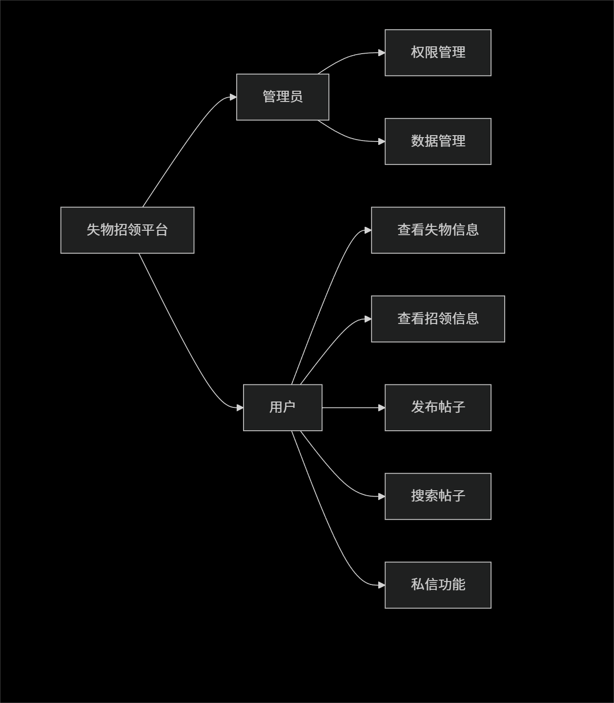
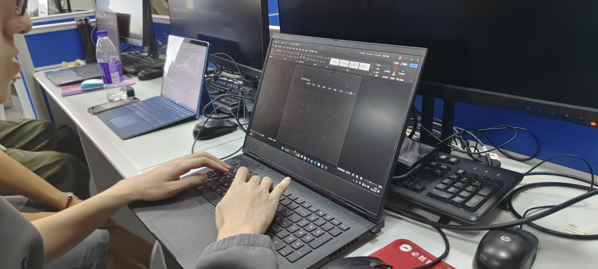

# 软件工程定项第一次会议记录

 * **参会者**：杨锐杰，王鹏宇，黄昊南，吴林垚
 * **时间**：2025年9月16号周二  南一楼

## 项目选择
基于Web平台或微信小程序的失物招领系统
（Web简化版或者app）
### 1. 主要技术栈
**分成前端和后端网页开发**

**前端**：html，css，js，进阶（Vue/react）。

**后端**：后端具体实现技术栈在商定中，可选方向有 Python（flask框架），java(ssm框架)。

### 2. 团队分工

**前端开发**：王鹏宇，吴林垚

**后端开发**：杨锐杰，黄昊南

**接口对接**：杨锐杰，王鹏宇，黄昊南，吴林垚

## 项目分析（头脑风暴）

### 1. 现有失物招领系统的不足
>* 目前企业微信的失物招领平台集成于应用中心，无独立入口，在学生群体中的使用率少

>* 由于企业微信的失物招领系统使用不便，同学们失物招领的帖子通常发布于论坛中，而论坛的消息较庞杂，容易错过失物招领的信息。

>* 目前的失物招领平台缺少私信功能，不便于交流沟通。

>* 目前的失物招领平台仅有地点标签，缺少地点标签，不便于查找帖子。

>* 管理体验较差，权限不清，界面优化一般，缺少可视化。

>* 失物管理不严，存在冒领与错领现象。

### 2. 改进方式

- [√] 建立独立网站（或小程序），将失物招领需求从论坛和应用中心中独立出来。

- [√] 增加私信功能，方便失主与找到物品的同学沟通。

- [√] 增加收藏帖子功能，方便看到帖子的好心人留意同学的失物。

- [√] 增加地点标签，方便查找帖子

- [√] 优化图形界面，使系统更加方便实用。

- [√] 增加LLM的API接口，利用AI自动生成与失物有关的特征问题,清晰流程与证据要求，避免冒领与错领现象。

### 3. 题目来源

* 企业微信的失物招领平台和校园集市。

### 4. 需求

* 注册

* 登陆

* 用户数据管理

* ai自动验证失物信息

* 查询失物招领信息

* 发布帖子

* 私信

* 收藏

* 标签搜索功能

* （附加功能）失物招领数据分析，推荐与失物信息有关的招领帖子

## 思维导图

## 会议图片

